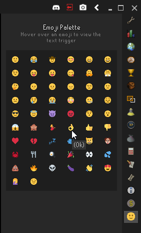

#  Emoji Palette
This plugin adds a panel on the main client navbar (right-hand side, with all the icons) listing all the emojis in the client.

Hover over the image to get the trigger text.

Unfortunately it's not possible to insert the emoji into the chat on-click.

## Feedback
Send any issues or feedback [here](https://www.github.com/hjdarnel/runelite-emoji-palette-plugin). Thanks!

## Example
